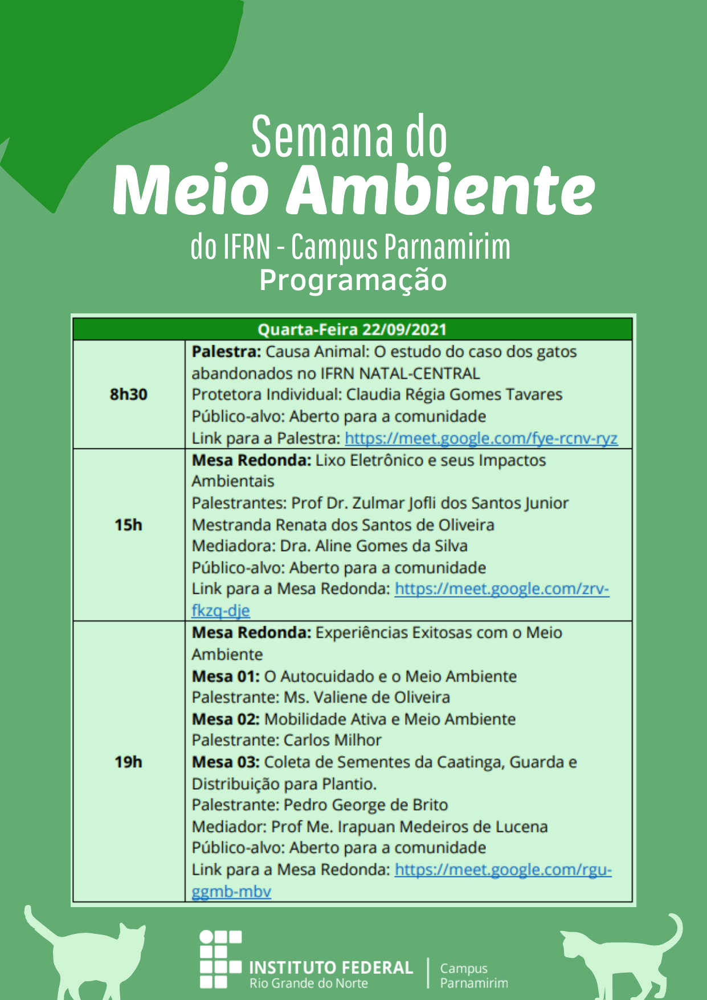

# Programação para quarta-feira, 22/set/2021

**QUARTA-FEIRA - 22/09/2021**

8h30 às 10h:

**Palestra: **

**Causa Animal: O estudo de caso dos gatinhos abandonados no IFRN NATAL
CENTRAL **

Protetora Independente: Claudia Régia Gomes Tavares (Profa Aposentada do
IFRN)

Público-alvo: Aberto para a comunidade

Link para a Palestra: <https://meet.google.com/fye-rcnv-ryz>

15h às 16h30

**Mesa Redonda**

**Lixo Eletrônico e seus Impactos Ambientais**

Prof Dr. Zulmar jofli dos Santos Junior (IFRN Campus Parnamirim)

Mestranda Renata dos Santos de Oliveira (Programa de Pós-graduação em
Uso dos Recursos Naturais -- PPgURN -- IFRN)

Mediador: Dra. Aline Gomes da Silva (Profa IFRN Campus Parnamirim)

Público-alvo: Aberto para a comunidade

Link para a Mesa Redonda: <https://meet.google.com/zrv-fkzq-dje>

19h -- 20h30

**Mesa Redonda:**

**Experiências Exitosas com o Meio Ambiente**

Mesa 01: O Autocuidado e o Meio Ambiente

Ms. Valiene de Oliveira (Mestre em Ciências Ambientais -- UFRN)

Mesa 02: Mobilidade Ativa e Meio Ambiente\
Carlos Milhor (Arquiteto, Urbanista e Designer Gráfico; Diretor do
Departamento de Engenharia de Trânsito DET/ STTU e Presidente da
Associação dos Ciclistas do Rio Grande do Norte -- ACIRN)

Mesa 03: Coleta de Sementes da Caatinga, Guarda e Distribuição para
Plantio.

Pedro George de Brito (Geografo; Colaborador da ONG BAOBÁ; Colaborador
dos Guardiãs da Terra; Colaborador do Arborizar é Vida de Acari-RN;
Presidente da Comissão de Tecnologia da Informação da OAB RN)

Mediador: Prof Me. Irapuan Medeiros de Lucena

Público-alvo: Aberto para a comunidade

Link para a Mesa Redonda: <https://meet.google.com/rgu-ggmb-mbv>

