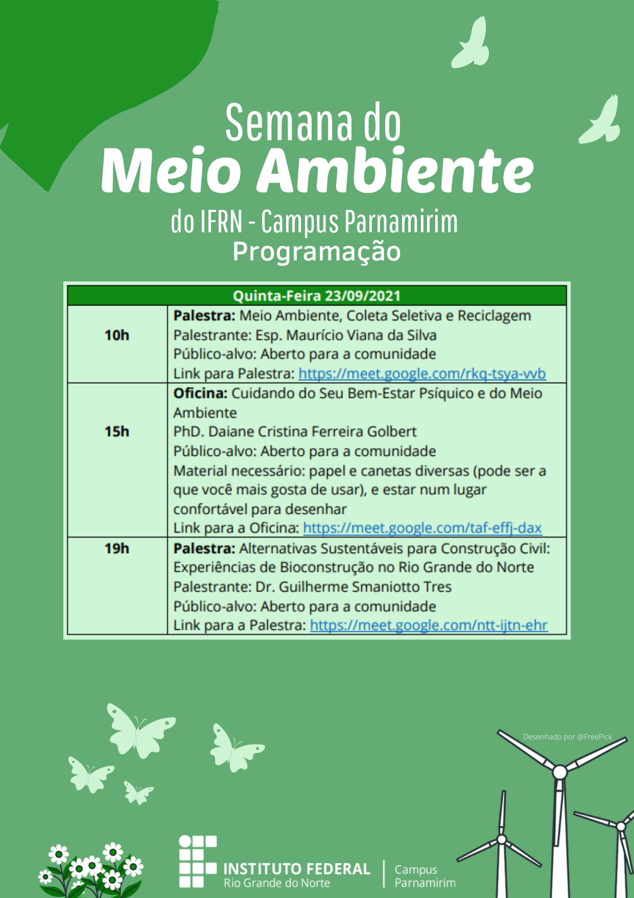

# Programação para quinta-feira, 23/set/2021

## Transcrição da imagem

**QUINTA-FEIRA - 23/09/2021**

10h -- 11h30

**Palestra: Meio Ambiente, Coleta Seletiva e Reciclagem**

Esp. Maurício Viana da Silva (Graduado em Gestão Ambiental pela UNP,
Especialista em Gestão Ambiental pelo IFRN e Diretor do Instituto
Sócio-ambiental Mata Atlântica do Sapé/ IMASPE Arêz-RN)

Público-alvo: Aberto para a comunidade

Link para Palestra: <https://meet.google.com/rkq-tsya-vvb>

15h às 16h30

**Oficina: **

**Cuidando do Seu Bem-Estar Psíquico e do Meio Ambiente **

PhD. Daiane Cristina Ferreira Golbert (Bióloga Geneticista, com
Pós-Doutorado em Neurociência, e Artista)

Público-alvo: Aberto para a comunidade

Material necessário: papel e canetas diversas (pode ser a que você mais
gosta de usar), e estar num lugar confortável para desenhar

Link para a Oficina: <https://meet.google.com/taf-effj-dax>

19h -- 20h30

**Palestra: **

**Alternativas Sustentáveis para Construção Civil: Experiências de
Bioconstrução no RN**

Dr. Guilherme Smaniotto Tres (Doutor em administração a Gestão social
pela UFRN)

Público-alvo: Aberto para a comunidade

Link para a Palestra: <https://meet.google.com/ntt-ijtn-ehr>

