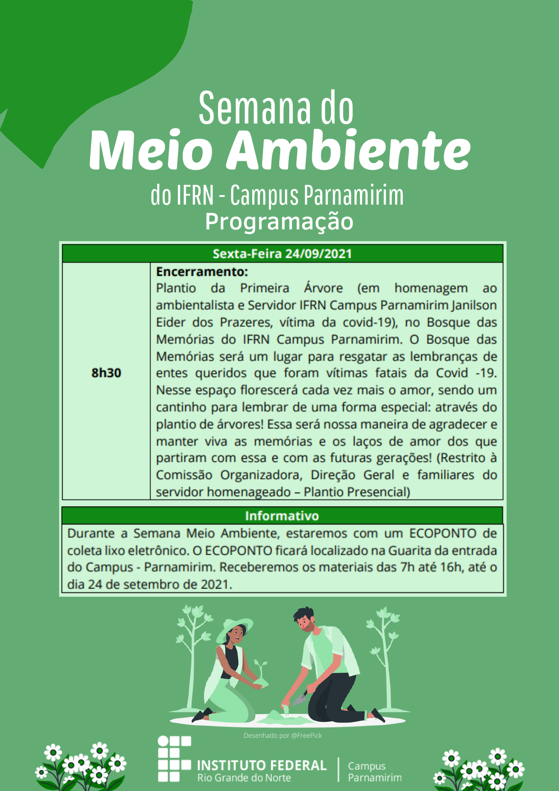

# # Programação para sexta-feira, 24/set/2021

## Transcrição da imagem

**SEXTA-FEIRA -- 24/09/2021**

8h30

Encerramento com plantio da Primeira Árvore (em homenagem ao
ambientalista e Servidor IFRN Campus Parnamirim Janilson Eider dos
Prazeres, vítima da covid-19), no Bosque das Memórias do IFRN Campus
Parnamirim. O Bosque das Memórias será um lugar para resgatar as
lembranças de entes queridos que partiram vítimas da Covid -19. Nesse
espaço florescerá cada vez mais o amor, sendo um cantinho para lembrar
de uma forma especial: através do plantio de árvores! Essa será nossa
maneira de agradecer e manter viva as memórias e os laços de amor dos
que partiram com essa e com as futuras gerações!

Presencial no Campus IFRN Parnamirim