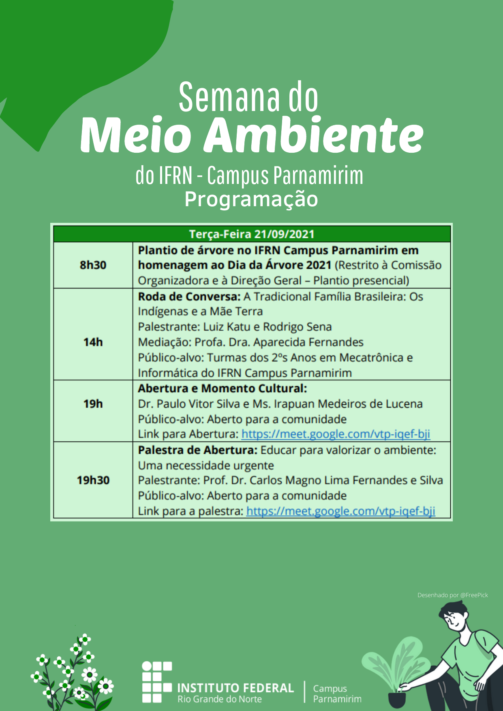

# # Programação para terça-feira, 21/set/2021

8h30:

Plantio de Árvore no IFRN Campus Parnamirim em Homenagem ao Dia da
Árvore 2021

Todos Convidados -- Plantio Presencial

14h

**Roda de Conversa: **

**A Tradicional Família Brasileira: Os Indígenas e a Mãe Terra**

Luiz Katu e Rodrigo Sena

Mediação: Profa Dra. Aparecida Fernandes

Público-alvo: Turmas dos 2ºs Anos em Mecatrônica e Informática do IFRN
Campus Parnamirim

19h

**Abertura **

Paulo Vitor (Diretor do Campus IFRN Campus Parnamirim) e Irapuan
Medeiros de Lucena (Coordenador da SEMENTE -- Semana de Meio Ambiente do
Campus Parnamirim)

**Momento Cultural**

**19h30 as 20h30**

**Palestra de Abertura -- Educar para valorizar o ambiente: Uma
necessidade urgente.**

Prof. Dr. Carlos Magno Lima Fernandes e Silva (Prof IFRN Campus
Parnamirim)

Público-alvo: Aberto para a comunidade

Link para Abertura: <https://meet.google.com/vtp-iqef-bji>

